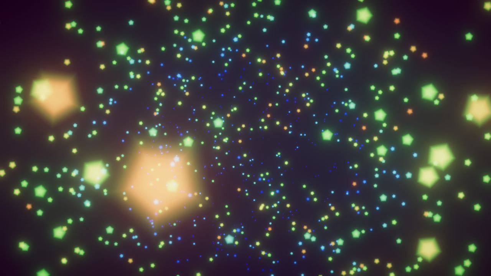
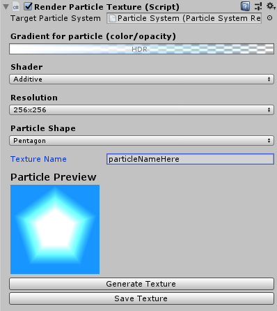
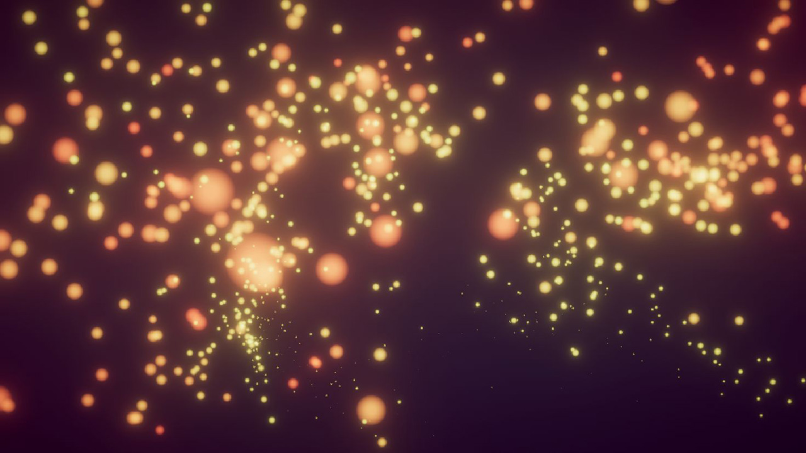
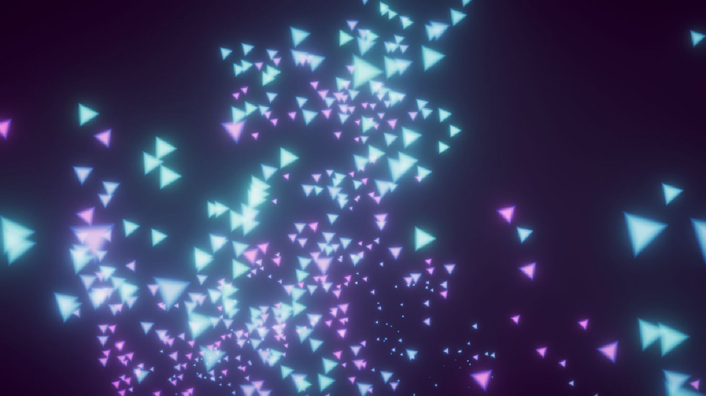

# RenderParticleTexture

This is a small Editor utility I created for testing out particles in Unity.

It's a big hassle (in my opinion) to go back'n'forth from Unity to an image processing application to just slightly tweak transparency or falloff of a particle texture. That's why I created this one.

This is not a full tool, but something I created just for my own needs and use-case. I will probably extend it later when I need something else.

I implemented the particle texture rendering in a compute shader so that it would be fast and snappy to use when tweaking settings.

## Features

- Generate both the particle shape and the color.
    - Colorization with a gradient.
- Procedural creation of particle shapes.
    - Distance fields used to generate smooth shapes.
    - 10+ available shapes.
- Rendering is handled on GPU using compute shaders.
- Texture will be applied automatically to the chosen particle system.
- Ability to save the generated texture to disk.
- Name texture.

- Custom Inspector with:
    - a Gradient Editor.
        - Edit both color and transparency.
    - Select shader.
        - Choose from pre-selected shader options.
    - Select resolution.
        - from 32x32 to 1024x1024.
    - Select particle shape.
    - Texture preview.
    - Supports Undo etc. Unity functionality.

## UI

## Generated particle textures in action

